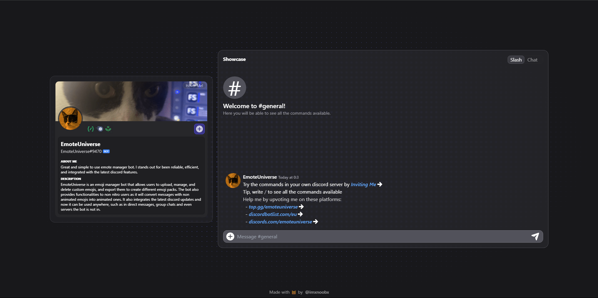

# 😺 Universe Portfolio



* This is a simple portfolio project that I created to showcase my [discord bot](https://github.com/IMXNOOBX/EmoteUniverse) and to learn Svelte.
> Check out the live version [**here**](https://bot.noob.bio/).

## 🚀 Getting Started

* Development
```bash
git clone https://github.com/IMXNOOBX/bot-portfolio.git
cd bot-portfolio
npm install
npm run dev
```

* Production
```bash
npm run build
```
> The build will be in the `build` folder and will be statically generated.

* Docker
```bash
docker build -t bot-portfolio .
docker run -d -p 80:80 bot-portfolio
```

# 🔖 License & Copyright

This project is licensed under [**CC BY-NC 4.0**](https://creativecommons.org/licenses/by-nc/4.0/).
```diff
+ You are free to:
	• Share: Copy and redistribute the material in any medium or format.
	• Adapt: Remix, transform, and build upon the material.
+ Under the following terms:
	• Attribution: You must give appropriate credit, provide a link to original the source repository, and indicate if changes were made.
	• Non-Commercial: You may not use the material for commercial purposes.
- You are not allowed to:
	• Sell: This license forbids selling original or modified material for commercial purposes.
	• Sublicense: This license forbids sublicensing original or modified material.
```
### ©️ Copyright
The content of this project is ©️ by [IMXNOOBX](https://github.com/IMXNOOBX) and the respective contributors. See the [LICENSE.md](LICENSE.md) file for details.